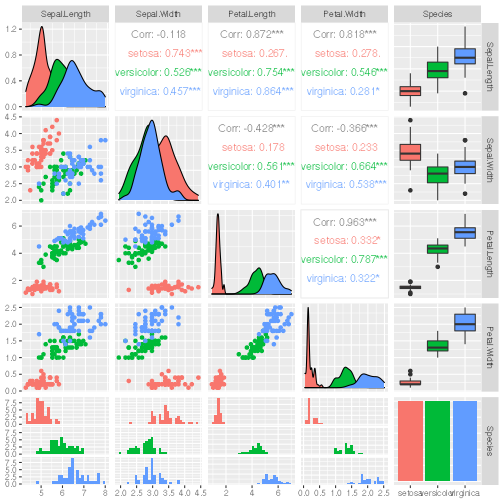

# Level 1

## Level 2

### Level 3

This is an R Markdown document. Markdown is a simple formatting syntax for authoring HTML, PDF, and MS Word documents. For more details on using R Markdown see <http://rmarkdown.rstudio.com>.

When you click the **Knit** button a document will be generated that includes both content as well as the output of any embedded R code chunks within the document. You can embed an R code chunk like this:


```r
library(caret)
library(GGally)
data(iris)
ind <- createDataPartition(iris$Species,p=0.6,list=F)
```

## Including Plots

You can also embed plots, for example:


```
## 
 plot: [1,1] [==>-----------------------------------------------------------------]  4% est: 0s 
 plot: [1,2] [====>---------------------------------------------------------------]  8% est: 1s 
 plot: [1,3] [=======>------------------------------------------------------------] 12% est: 1s 
 plot: [1,4] [==========>---------------------------------------------------------] 16% est: 1s 
 plot: [1,5] [=============>------------------------------------------------------] 20% est: 1s 
 plot: [2,1] [===============>----------------------------------------------------] 24% est: 1s 
 plot: [2,2] [==================>-------------------------------------------------] 28% est: 1s 
 plot: [2,3] [=====================>----------------------------------------------] 32% est: 1s 
 plot: [2,4] [=======================>--------------------------------------------] 36% est: 1s 
 plot: [2,5] [==========================>-----------------------------------------] 40% est: 1s 
 plot: [3,1] [=============================>--------------------------------------] 44% est: 1s 
 plot: [3,2] [================================>-----------------------------------] 48% est: 1s 
 plot: [3,3] [==================================>---------------------------------] 52% est: 1s 
 plot: [3,4] [=====================================>------------------------------] 56% est: 1s 
 plot: [3,5] [========================================>---------------------------] 60% est: 1s 
 plot: [4,1] [===========================================>------------------------] 64% est: 1s 
 plot: [4,2] [=============================================>----------------------] 68% est: 1s 
 plot: [4,3] [================================================>-------------------] 72% est: 1s 
 plot: [4,4] [===================================================>----------------] 76% est: 0s 
 plot: [4,5] [=====================================================>--------------] 80% est: 0s 
 plot: [5,1] [========================================================>-----------] 84% est: 0s `stat_bin()` using `bins = 30`. Pick better value with `binwidth`.
## 
 plot: [5,2] [===========================================================>--------] 88% est: 0s `stat_bin()` using `bins = 30`. Pick better value with `binwidth`.
## 
 plot: [5,3] [==============================================================>-----] 92% est: 0s `stat_bin()` using `bins = 30`. Pick better value with `binwidth`.
## 
 plot: [5,4] [================================================================>---] 96% est: 0s `stat_bin()` using `bins = 30`. Pick better value with `binwidth`.
## 
 plot: [5,5] [====================================================================]100% est: 0s 
                                                                                                
```



Note that the `echo = FALSE` parameter was added to the code chunk to prevent printing of the R code that generated the plot.
